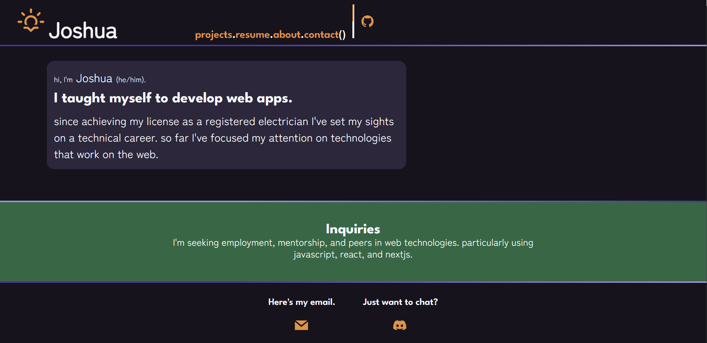
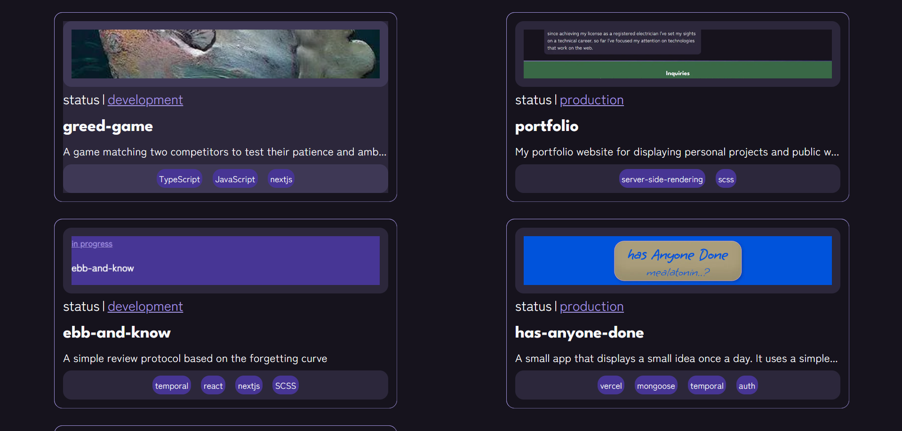
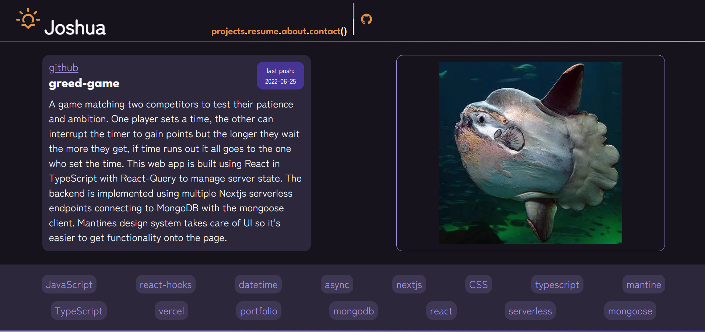

# Portfolio
My site for displaying past, ongoing work, and a little personal background. It is intentional modest in terms of styling as I wanted to trying styling everything from scratch with SCSS. The site is statically rendered and incrementally regenerated, so it should provide a snappy experience, other than cold starts. Much of the content is pulled down my repos through Github's grapqhql api at build time.
  
[View Demo](https://joneilltechnicalportfolio.vercel.app/) · [Report Bug](https://github.com/CarpentersKeys/greed-game/issues)

## About The Project 

([back to top](#top))

### Built With 
* [Next.js](https://nextjs.org/) 
* [React.js](https://reactjs.org/) 
* [Github-API](https://docs.github.com/en/graphql)
* [Graphql-Query](https://graphql.org/)

## Check it out!
The [site](https://joneilltechnicalportfolio.vercel.app/) is hosted on Vercel so please go ahead and take a look around.

([back to top](#top))

## Current State
### Home/About/Resume
All the content is hardcode on these pages, most of the work went into styling them to apear conistent and responsive across various viewports. There are three breakpoints on all pages placed strategically to accomodate most mobile devices, tablets and monitors.
### Projects
Githubs grapql API makes it possible to query for details about ones repositories and other profile information. Using an Auth Token the site is able to proxy as the repository owner, the permissions for this instance are limited to public access as the use case is simplistic but theoretically much more powerful interface with Github functionality is possible.

### Indivual Projects
Clicking through the Projects page takes the user to a dynamically generated details page for the given project. The Nextjs framework is capable of running programatic datafetching at build time on the Vercel servers before populating and statically generating the list of paths based on the given data. That's what's done here.

([back to top](#top))
### Future
Improvements could be made to the data fetching, as it stands multiple fetches are made during the population of the paths, and rendering of pages. This unfortunately reduces to value gained by making a graphql query rather than a REST. However, some data was not available through the REST API so graphql needed to be used as a matter of course. This isn't a significant problem as these calls only happen in the background when it's time for a new build, but build time could be optimized by sharing the data from one call across the different server processes.

## Contact Joshua - 
joneilltechnical@gmail.com

([back to top](#top))

License Distributed under the MIT License.